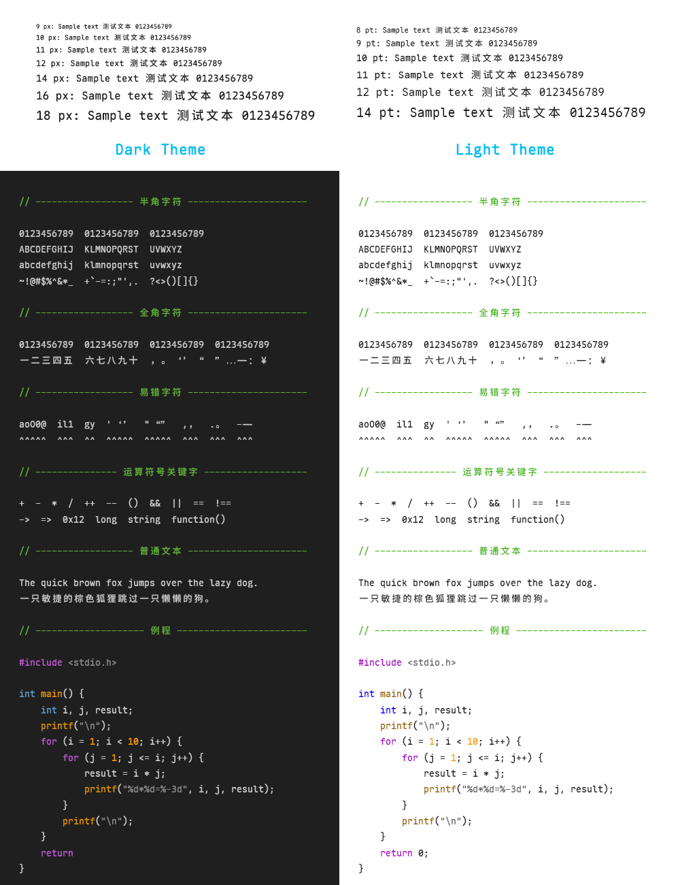

  
  
  
  

# Code Maple

[Code Maple](https://github.com/dk-sirk/code-maple-font) 是一款适合编程使用的定制 [Maple Mono](https://github.com/subframe7536/maple-font) 字体，严格等宽、易读、单文件。

# 特性

- 中英文全部 2:1 严格等距，包括全角符号，例如：双引号`“”`、单引号`‘’`、省略号`……`、破折号`——`
- 采用更易读的印刷风格，例如：`0 / a / g / i / l / @`
- 常规和斜体风格保持保持一致
- 使用微调选项，低dpi屏幕适用
- 取消连字，输入什么就是什么
- 不用理解复杂的字体术语，只有一个文件，用这个就对了！

# 样本

# 下载

[Release](https://github.com/dk-sirk/code-maple-font/releases)

# 鸣谢

[Maple Mono](https://github.com/subframe7536/maple-font)

# Star History

# 许可

SIL Open Font License 1.1